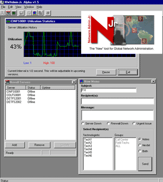



## Novell Administrator Jr 1\.5

### Description

Please vote and help a starving developer out :) Retrieves critical information like (Uptime, CPU, Utilization, User and connection info) from Novell 4/5 Servers and presents it in a nice GUI interface. Designed for Support Technologists who need to check and monitor the status of Novell servers. The program also features a utility to send email through the Lotus Notes client. Please Vote for this code!
 
### More Info
 
Server Name

You need to have the Novell Client for server functionality and Lotus Notes 4.6/R5 for Notes functionality. Pretty easy to use.(I hope) You Add your server to list of servers. Double click on the name of your server when it pops into the list and Wa! La! Information at your finger tips. Please vote

Uptime, CPU, Graphical Utilization

A bug. When you pull your server stats for the first time, The critical stats don't show. However, from that point on the critical stats will show up. I know it is there but haven't had time to track down the culprit.

             |
---                |---
**Submitted On**   |2001-10-09 11:20:46
**By**             |[Corey Coatney](https://github.com/Planet-Source-Code/PSCIndex/blob/master/ByAuthor/corey-coatney.md)
**Level**          |Advanced
**User Rating**    |5.0 (25 globes from 5 users)
**Compatibility**  |VB 5\.0, VB 6\.0
**Category**       |[Complete Applications](https://github.com/Planet-Source-Code/PSCIndex/blob/master/ByCategory/complete-applications__1-27.md)
**World**          |[Visual Basic](https://github.com/Planet-Source-Code/PSCIndex/blob/master/ByWorld/visual-basic.md)
**Archive File**   |[Novell Adm282101092001\.zip](https://github.com/Planet-Source-Code/corey-coatney-novell-administrator-jr-1-5__1-27939/archive/master.zip)

### API Declarations

Please vote for this code!!! :)Many. All in the Code. Email me if you have any specific questions.

